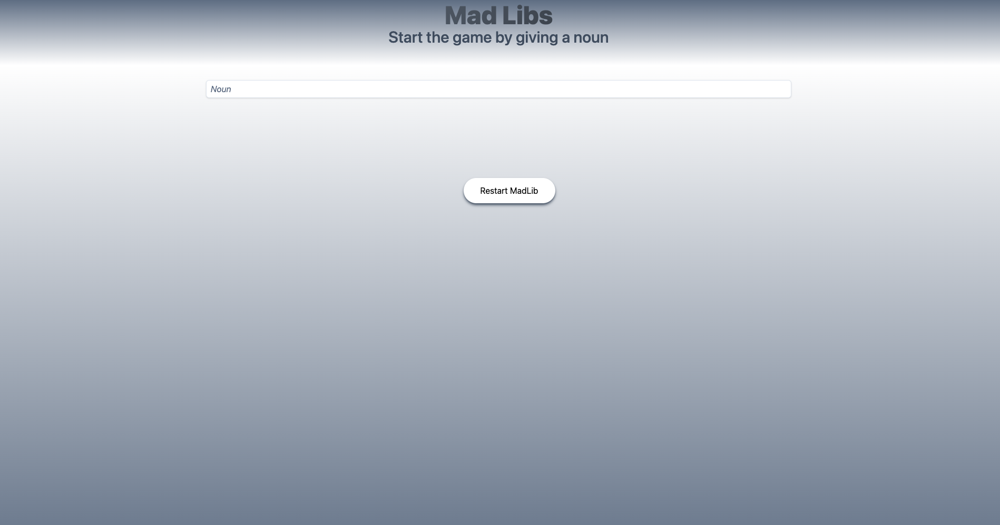

# MadLibTs

### Description

This is a simple MVP of a MadLibs game written in Typescript. It is a simple game that asks the user to fill in the blanks of a story. The user is then given the story with the blanks filled in.

### Screenshots

### Technologies

    
    
    
    
 

### Link

https://jovial-gumdrop-713a07.netlify.app

### Author

Oscar Silva
